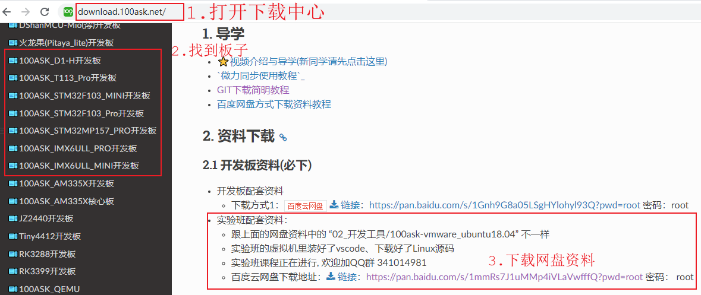
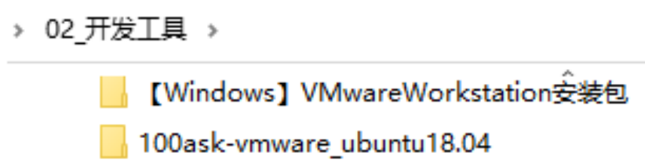
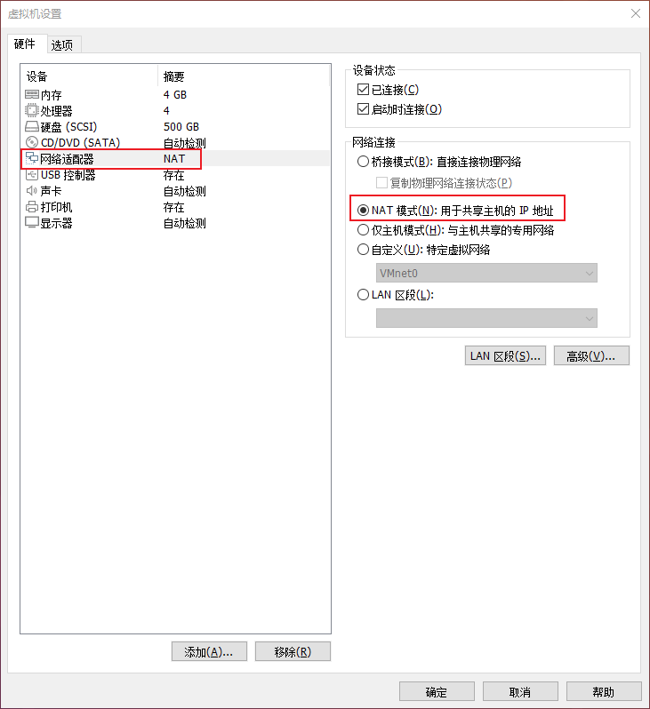
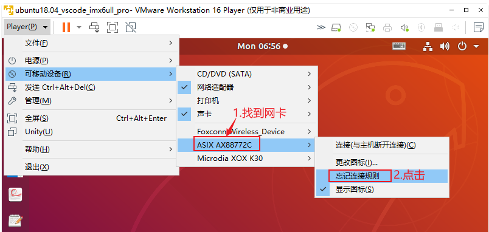
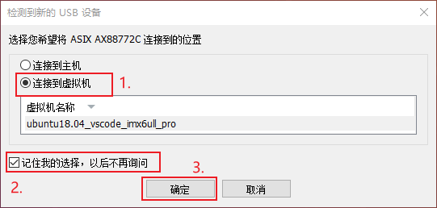
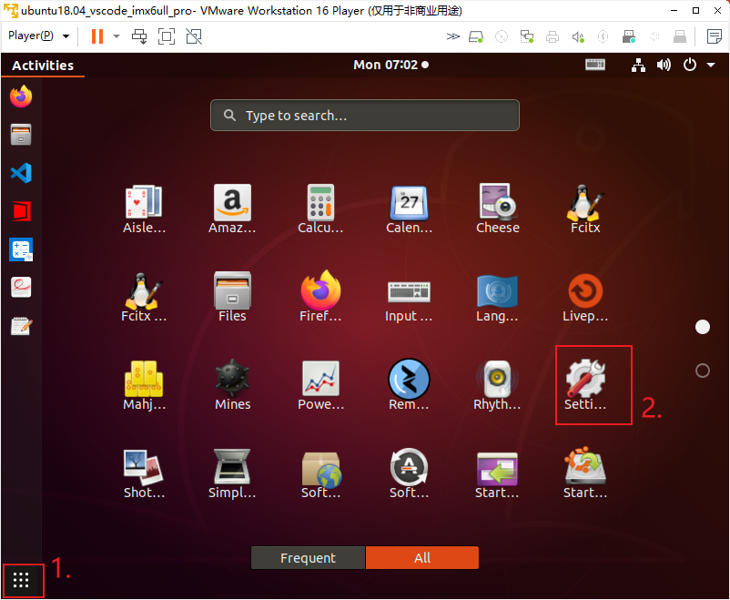
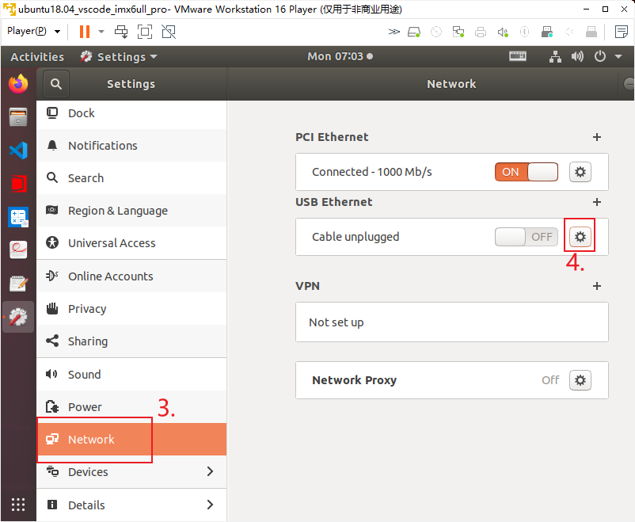
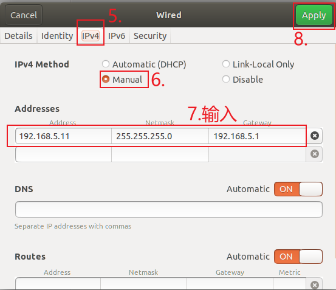
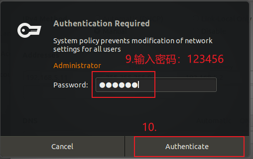

# 搭建环境

## 1. 下载Ubuntu镜像

百问网制作了安装好了所有软件的Ubuntu镜像，对于初学者没必要在搭建环境上浪费时间，建议使用我们制作好的映像文件。



按照自己使用的开发板下载对应的网盘文件，虚拟机和Ubuntu镜像在网盘如下目录里：



下载到资料后：

* 安装vmware虚拟机
* 解压Ubuntu镜像文件
* 使用vmware打开镜像文件、启动Ubuntu


## 2. 设置VMWare网络

### 2.1 NAT网卡

Ubuntu通过NAT网卡上网，我们提供的Ubuntu默认已经支持了NAT网卡。

打开虚拟机时，点击"编辑虚拟机"，确保网卡是NAT网卡：




### 2.2 USB网卡

#### 2.2.1 连接网卡

在日常开发中，开发板和Ubuntu之间通过网络传输数据：

* 开发板自带网卡
* Ubuntu使用USB网卡：把USB网卡插到电脑后，在虚拟机里选择把USB网卡连接到虚拟机
  * 如果插入USB网卡时没有自动弹出对话框，则如下图选择"忘记连接规则"
    

  * 然后重插USB网卡，在弹出的对话框中如下选择：
    


#### 2.2.2 设置静态IP

在Ubuntu中设置USB网卡的IP位静态IP，如下图操作：












#### 2.2.3 验证

使用网线连接开发板的网口和USB网卡，启动开发板。

在开发板上执行：

```shell
ifconfig eth0 192.168.5.9
ping 192.168.5.11
```


## 3. USB串口

### 3.1 连接到虚拟机


### 3.2 确认设备节点

在Ubuntu中执行dmesg命令，查看信息，找到ttyUSB0或ttyACM0这样的文字，就可以知道USB串口对应的设备节点。

然后在Ubuntu中启动WindTerm，就可以建立一个session，操作串口了。


## 4. vscode使用示例

