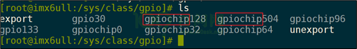
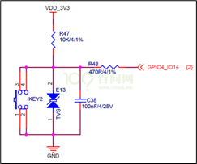
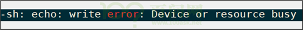
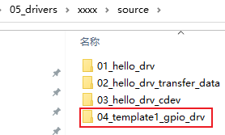
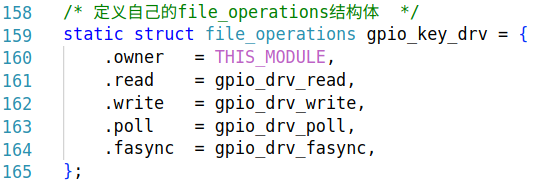
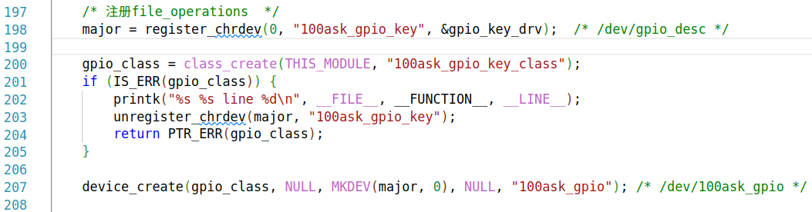
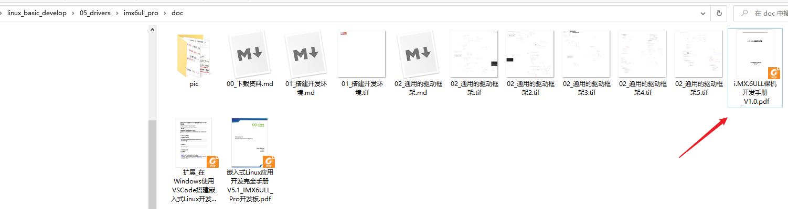
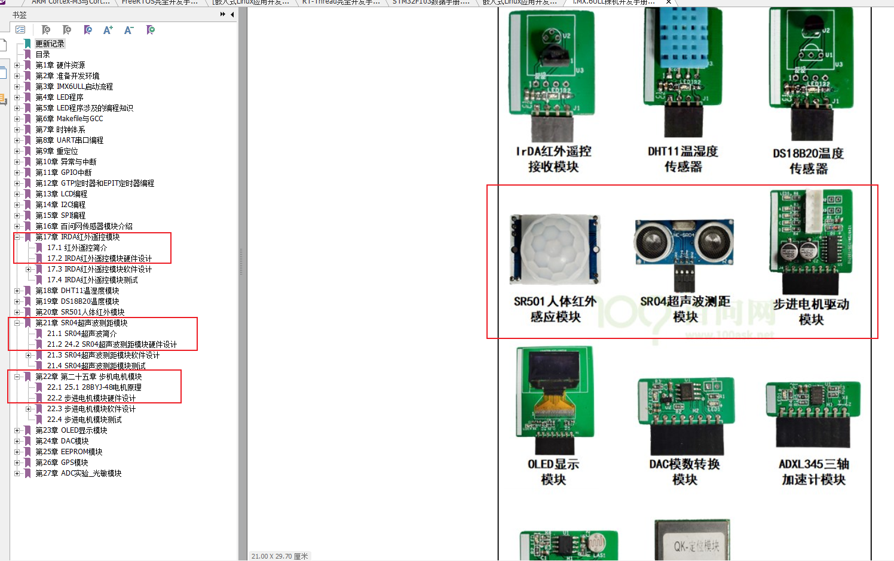

# 通用的驱动框架

## 1. 怎么写最简单的驱动

### 1.1 一切都是文件


### 1.2 写驱动程序的步骤

* 构造file_operations结构体

  * 在里面填充open/read/write/ioctl成员

* 注册file_operations结构体

  * int major = register_chrdev(0, "name", &fops);

* 入口函数：调用regiister_chrdev

* 出口函数：调用unregiister_chrdev

* 辅助信息：

  * class_create/class_destroy
  * device_create/device_destroy

  

### 1.3 hello驱动程序

源码在GIT仓库如下目录：

```shell
source/01_hello_drv
```


```c
#include <linux/mm.h>
#include <linux/module.h>
#include <linux/miscdevice.h>
#include <linux/slab.h>
#include <linux/vmalloc.h>
#include <linux/mman.h>
#include <linux/random.h>
#include <linux/init.h>
#include <linux/raw.h>
#include <linux/tty.h>
#include <linux/capability.h>
#include <linux/ptrace.h>
#include <linux/device.h>
#include <linux/highmem.h>
#include <linux/backing-dev.h>
#include <linux/shmem_fs.h>
#include <linux/splice.h>
#include <linux/pfn.h>
#include <linux/export.h>
#include <linux/io.h>
#include <linux/uio.h>

#include <linux/uaccess.h>


static int major;

static int hello_open (struct inode *node, struct file *filp)
{
    printk("%s %s %d\n", __FILE__, __FUNCTION__, __LINE__);
    return 0;
}
static ssize_t hello_read (struct file *filp, char __user *buf, size_t size, loff_t *offset)
{
    printk("%s %s %d\n", __FILE__, __FUNCTION__, __LINE__);
    return size;
}

static ssize_t hello_write(struct file *filp, const char __user *buf, size_t size, loff_t *offset)
{
    printk("%s %s %d\n", __FILE__, __FUNCTION__, __LINE__);
    return size;
}

static int hello_release (struct inode *node, struct file *filp)
{
    printk("%s %s %d\n", __FILE__, __FUNCTION__, __LINE__);
    return 0;
}

/* 1. create file_operations */
static const struct file_operations hello_drv = {
    .owner      = THIS_MODULE,
	.read		= hello_read,
	.write		= hello_write,
	.open		= hello_open,
    .release    = hello_release,
};


/* 2. register_chrdev */

/* 3. entry function */
static int hello_init(void)
{
   major = register_chrdev(0, "100ask_hello", &hello_drv);
   return 0;
}


/* 4. exit function */
static void hello_exit(void)
{
    unregister_chrdev(major, "100ask_hello");
}


module_init(hello_init);
module_exit(hello_exit);
MODULE_LICENSE("GPL");
```


### 1.4 上机测试

在开发板上：

```shell
# insmod hello_drv.ko

# cat /proc/devices
Character devices:
  1 mem
  4 /dev/vc/0
  4 tty
  5 /dev/tty
  5 /dev/console
  5 /dev/ptmx
  7 vcs
 10 misc
 13 input
 29 fb
 81 video4linux
 89 i2c
 90 mtd
108 ppp
116 alsa
128 ptm
136 pts
166 ttyACM
180 usb
188 ttyUSB
189 usb_device
207 ttymxc
216 rfcomm
226 drm
245 100ask_hello
246 ttyGS
247 ttyLP
248 watchdog
249 tee
250 iio
251 ptp
252 pps
253 rtc
254 gpiochip

Block devices:
  1 ramdisk
259 blkext
  7 loop
  8 sd
 31 mtdblock
 65 sd
 66 sd
 67 sd
 68 sd
 69 sd
 70 sd
 71 sd
128 sd
129 sd
130 sd
131 sd
132 sd
133 sd
134 sd
135 sd
179 mmc

# mknod  /dev/xyz c 245 0

# ./hello_test /dev/xyz  100ask

# ./hello_test /dev/xyz
```


## 2. APP和驱动的交互方式

### 2.1 传输数据

APP和驱动：

* copy_to_user
* copy_from_user

驱动和硬件：

* 各个子系统的函数
* 通过ioremap映射寄存器地址后，直接访问寄存器


### 2.2 APP使用驱动的4种方式

驱动程序：提供能力，不提供策略

* 非阻塞(查询)
* 阻塞(休眠-唤醒)
* poll(定个闹钟)
* 异步通知


妈妈怎么知道卧室里小孩醒了？

* 时不时进房间看一下： 查询方式

  *  简单，但是累

*  进去房间陪小孩一起睡觉，小孩醒了会吵醒她： 休眠-唤醒

  * 不累，但是妈妈干不了活了

* 妈妈要干很多活，但是可以陪小孩睡一会，定个闹钟： poll 方式
    *  要浪费点时间， 但是可以继续干活。
    * 妈妈要么是被小孩吵醒，要么是被闹钟吵醒。
* 妈妈在客厅干活，小孩醒了他会自己走出房门告诉妈妈： 异步通知
  * 妈妈、小孩互不耽误


### 2.3 中断的作用


## 3. 通用框架1_最简单

### 3.1 GPIO子系统

#### 3.1.1 引脚编号

在硬件上如何确定GPIO引脚？它属于哪组GPIO？它是这组GPIO里的哪个引脚？需要2个参数。

但是在Linux软件上，可以使用引脚编号来表示。

在开发板上执行如下命令查看已经在使用的GPIO状态：

```shell
# cat /sys/kernel/debug/gpio
gpiochip0: GPIOs 0-15, parent: platform/soc:pin-controller@50002000, GPIOA:
 gpio-10  (                    |heartbeat           ) out lo
 gpio-14  (                    |shutdown            ) out hi

gpiochip1: GPIOs 16-31, parent: platform/soc:pin-controller@50002000, GPIOB:
 gpio-26  (                    |reset               ) out hi ACTIVE LOW

gpiochip2: GPIOs 32-47, parent: platform/soc:pin-controller@50002000, GPIOC:

gpiochip3: GPIOs 48-63, parent: platform/soc:pin-controller@50002000, GPIOD:
```

可以看到：在Linux系统中可以使用编号来访问某个GPIO。

怎么确定GPIO引脚的编号？方法如下：

①  先在开发板的/sys/class/gpio目录下，找到各个gpiochipXXX目录：



②  然后进入某个gpiochipXXX目录，查看文件label的内容，就可以知道起始号码XXX对于哪组GPIO


#### 3.1.2 基于sysfs操作引脚

以100ask_imx6ull为例，它有一个按键，原理图如下：



那么GPIO4_14的号码是96+14=110，可以如下操作读取按键值：

```shell
[root@100ask:~]# echo 110 > /sys/class/gpio/export              // gpio_request
[root@100ask:~]# echo in > /sys/class/gpio/gpio110/direction    // gpio_direction_input
[root@100ask:~]# cat /sys/class/gpio/gpio110/value              // gpio_get_value
[root@100ask:~]# echo 110 > /sys/class/gpio/unexport            // gpio_free
```


**注意**：如果驱动程序已经使用了该引脚，那么将会export失败，会提示下面的错误：



对于输出引脚，假设引脚号为N，可以用下面的方法设置它的值为1：

```shell
[root@100ask:~]# echo N > /sys/class/gpio/export
[root@100ask:~]# echo out > /sys/class/gpio/gpioN/direction
[root@100ask:~]# echo 1 > /sys/class/gpio/gpioN/value
[root@100ask:~]# echo N > /sys/class/gpio/unexport
```


#### 3.1.3 GPIO子系统的函数

GPIO子系统函数有新、老两套：

| **descriptor-based**       | **legacy**            |
| -------------------------- | --------------------- |
| **获得GPIO**               |                       |
| **gpiod_get**              | gpio_request          |
| **gpiod_get_index**        |                       |
| **gpiod_get_array**        | gpio_request_array    |
| **devm_gpiod_get**         |                       |
| **devm_gpiod_get_index**   |                       |
| **devm_gpiod_get_array**   |                       |
| **设置方向**               |                       |
| **gpiod_direction_input**  | gpio_direction_input  |
| **gpiod_direction_output** | gpio_direction_output |
| **读值、写值**             |                       |
| **gpiod_get_value**        | gpio_get_value        |
| **gpiod_set_value**        | gpio_set_value        |
| **释放GPIO**               |                       |
| **gpio_free**              | gpio_free             |
| **gpiod_put**              | gpio_free_array       |
| **gpiod_put_array**        |                       |
| **devm_gpiod_put**         |                       |
| **devm_gpiod_put_array**   |                       |

### 3.2 中断函数

#### 3.2.1 使用中断的流程

在驱动程序里使用中断的流程如下：

* 确定中断号

* 注册中断处理函数，函数原型如下：

  ```shell
  int request_irq(unsigned int irq, irq_handler_t handler, unsigned long flags,
  	    const char *name, void *dev);
  ```

* 在中断处理函数里

  * 分辨中断
  * 处理中断
  * 清除中断


#### 3.2.2 函数细节

request_irq函数的第1个参数是中断号，可以根据GPIO函数获得中断号：

```c
int gpio_to_irq(unsigned int gpio);
int gpiod_to_irq(const struct gpio_desc *desc);
```


request_irq函数的第2个参数是函数指针：

```c
enum irqreturn {
	IRQ_NONE		= (0 << 0),
	IRQ_HANDLED		= (1 << 0),
	IRQ_WAKE_THREAD		= (1 << 1),
};
typedef enum irqreturn irqreturn_t;
typedef irqreturn_t (*irq_handler_t)(int irq, void *dev);
```


request_irq函数的第3个参数有如下取值：

```c
#define IRQF_TRIGGER_NONE	0x00000000
#define IRQF_TRIGGER_RISING	0x00000001
#define IRQF_TRIGGER_FALLING	0x00000002
#define IRQF_TRIGGER_HIGH	0x00000004
#define IRQF_TRIGGER_LOW	0x00000008

#define IRQF_SHARED		0x00000080
```


request_irq函数的第4个参数是中断的名字，可以在执行`cat /proc/interrupts`的结果里查看。

request_irq函数的第5个参数是给中断处理函数使用的。


### 3.3 代码解读



#### 3.3.1 file_operations

分配/设置/注册file_operations结构体：

* 设置



* 注册
  


#### 3.3.2 GPIO的操作


#### 3.3.3 中断的处理


#### 3.3.4 定时器


#### 3.3.5 交互流程解读

* 非阻塞
* 阻塞
* POLL
* 异步通知


## 4. 预习

预习文档里的硬件操作原理。






## 5. 通用框架2_设备树


### 5.1 总线设备驱动模型


### 5.2 设备树的引入


### 5.3 代码解读

