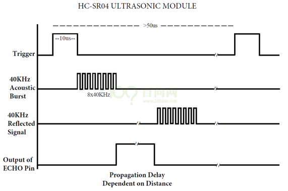

# 使用模板操作硬件

## 1. LED


### 1.1 IMX6ULL


### 1.2 STM32MP157

第1步：确认引脚编号并修改led_drv.c


PA10的编号：10

PG8的编号：96+8=104


第2步：修改设备树`arch/arm/boot/dts/stm32mp15xx-100ask.dtsi`


第3步：编译设备树

```shell
make dtbs
```


第4步：替换设备树

```shell
// Ubuntu
cp arch/arm/boot/dts/stm32mp157c-100ask-512d-lcd-v1.dtb ~/nfs_rootfs/

// 开发板
mount /dev/mmcblk2p2 /boot
cp /mnt/stm32mp157c-100ask-512d-lcd-v1.dtb  /boot
```


### 1.3 D1H


第1步：确认引脚编号


在arch/risc/boot/dts/board.dts里搜上图的红框中的文字，确认引脚是哪个，根据它们的编号推理出：

* 每个PORT占据32个引脚编号
* 反推出PC1的编号是65


其实，有一个计算公式：每组GPIO占据32个编号，编号从0开始，第1组GPIO叫PA。那么PC1的编号就是 2*32+1=65


## 2. 按键


## 3. 红外感应

### 3.1 接口图

#### 3.1.1 IMX6ULL

以IMX6ULL为例，下图是跟红外模块的接口图：


* GPIO4 ==> 第3组 ===> 起始编号 = 3*32 = 96
* GPIO4_19的编号：96+19=115


#### 3.1.2 STM32MP157


* GPIOA ==> 第0组 ===> 起始编号 = 0*16= 0
* GPIOA_5的编号：0+5=5


#### 3.1.3 D1H

PA,PB,PC :每组占据32个编号，PC1的编号 = 2*32 + 1 = 65


#### 3.1.4 T113

PA,PB,PC :每组占据32个编号，PC1的编号 = 2*32 + 1 = 65


### 3.2 修改模板


## 4. 超声波测距模块

### 4.1 SR04工作原理



要测距，需如下操作：

* 触发：向Trig（脉冲触发引脚）发出一个大约10us的高电平。
  * 模块就自动发出8个40Khz的超声波，超声波遇到障碍物后反射回来，模块收到返回来的超声波。

* 回响：模块接收到反射回来的超声波后，Echo引脚输出一个与检测距离成比例的高电平。
* 我们只要计算Echo引脚维持高电平的时间T即刻计算举例：D = 340*T/2。


### 4.2 核心函数

测试内核精确的时间：`ktime_get_ns`


### 4.3 编程

以IMX6ULL为例：


确定引脚编号：

* GPIO4_19的编号3*32+19 = 115
* GPIO4_20的编号3*32+19 = 116


## 5. 步进电机