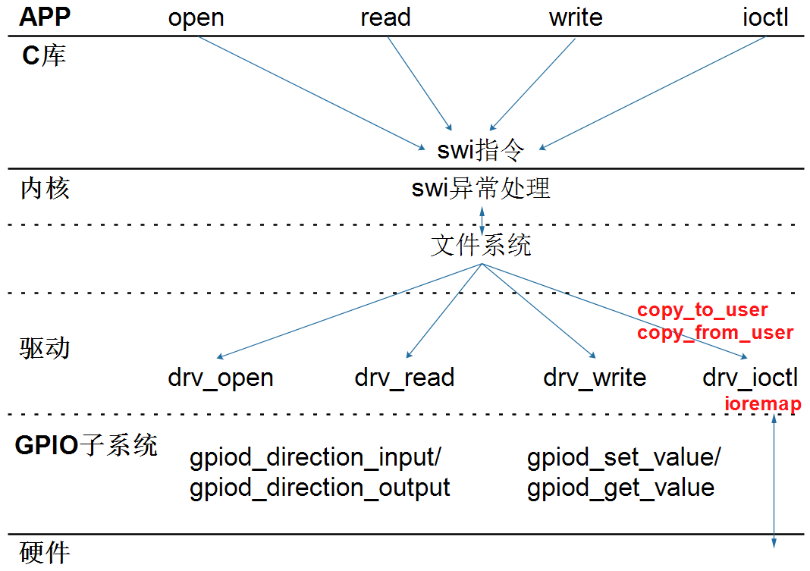

# 通用的驱动框架

## 1. 怎么写最简单的驱动

### 1.1 一切都是文件

### 1.2 写驱动程序的步骤

* 构造file_operations结构体

  * 在里面填充open/read/write/ioctl成员

* 注册file_operations结构体

  * int major = register_chrdev(0, "name", &fops);

* 入口函数：调用regiister_chrdev

* 出口函数：调用unregiister_chrdev

* 辅助信息：

  * class_create/class_destroy
  * device_create/device_destroy

  

### 1.3 hello驱动程序

## 2. APP和驱动的交互方式

* 非阻塞(查询)
* 阻塞(休眠-唤醒)
* poll(定个闹钟)
* 异步通知

## 3. 通用框架1_最简单

### 3.1 GPIO函数

### 3.2 中断函数

### 3.3 代码解读

## 4. 通用框架2_设备树

### 4.1 总线设备驱动模型

### 4.2 设备树的引入

### 4.3 代码解读

