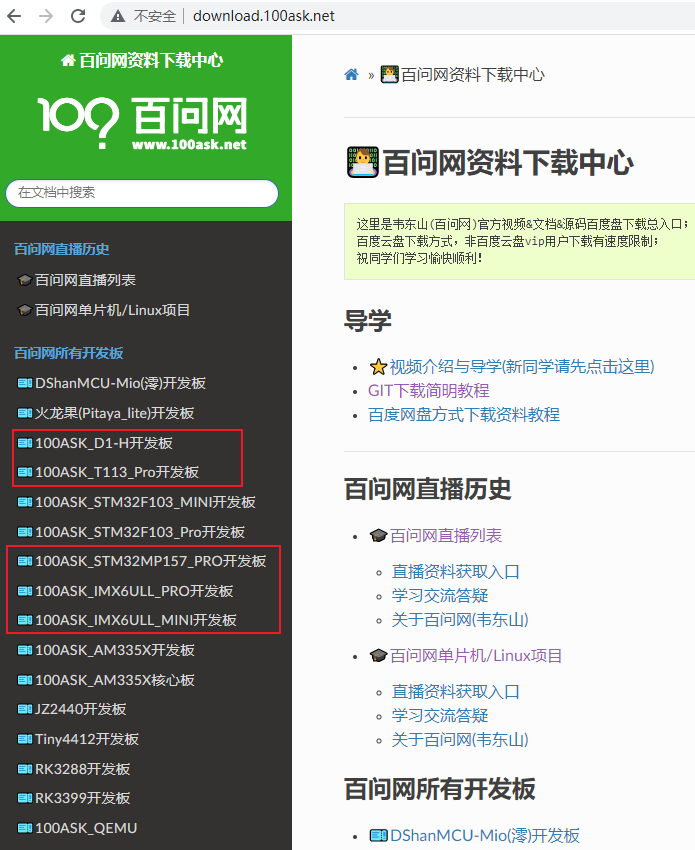
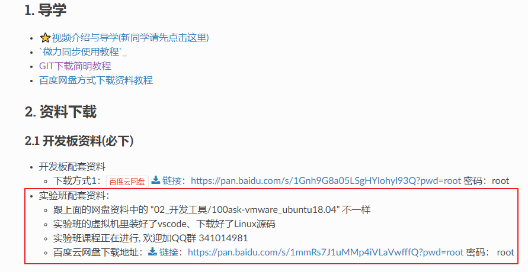
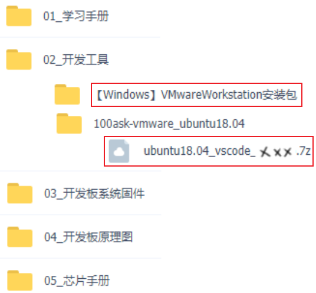
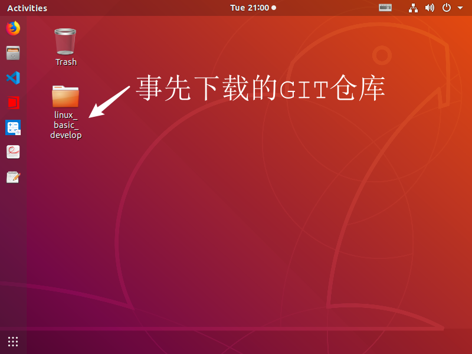
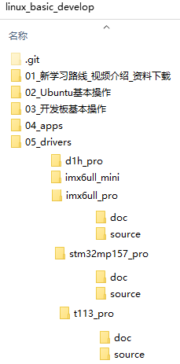

# 下载资料

## 1. 资料分类

资料分为2部分：

* 百度网盘中的开发板配套资料
  * 里面含有原理图、芯片手册、工具、Ubuntu镜像
  * 网盘地址：http://download.100ask.net/
* GIT仓库中讲课时制作的文档、编写的源码
  * GIT地址：https://e.coding.net/weidongshan/linux_course/linux_basic_develop.git
  * 这个地址无法使用浏览器打开，要使用GIT来下载
  * 可以在Ubuntu中下载


##  2. 下载网盘资料

### 2.1 下载地址

打开http://download.100ask.net/，在左侧可以看到各类开发板，目前本教程支持下图左侧红框中的开发板：




以任意款板子为例，点击它可以看到如下页面：

* 下载"实验班配套资料"即可
* 先在浏览器打开网盘链接，转存到自己的网盘，在使用"百度网盘"APP下载
* 不要再浏览器里直接下载：文件巨大，使用浏览器下载会失败的




### 2.2 网盘资料详情

各类开发板的网盘目录都是类似的，如下：



下载到资料后：

* 安装VMware
* 解压ubuntu18.04_vscode_xxx.7z (xxx表示单板名称)
* 使用VMware打开Ubuntu镜像、启动Ubuntu


## 3. 下载GIT仓库资料

如果你使用的Ubuntu桌面没有事先下载GIT仓库，那么需要自行下载：

* GIT地址：https://e.coding.net/weidongshan/linux_course/linux_basic_develop.git
* GIT教程：http://download.100ask.org/tools/Software/git/how_to_use_git.html

### 3.1 更新GIT仓库

为方便开发，我们在Ubuntu中已经事先下载了GIT仓库，放在桌面：




你需要做的是：每次打开Ubuntu后，更新GIT仓库。在Ubuntu中打开终端，执行如下命令即可：

```shell
$ cd ~/Desktop/linux_basic_develop/
$ git pull
```

注意：

* 不要修改GIT仓库里的文件，甚至不要直接打开里面的文件，先把它复制到其他目录再使用。
* 因为一旦更改了Ubuntu中GIT仓库里的文件，下次更新时就会提示有冲突。


### 3.2 GIT仓库内容

规划中的内容如下(有些目录还没有)：



目前正在录制"驱动实验课程"，它在"05_drivers"目录下(为方便编译故意使用英文路径)：

* 这个目录下针对单板创建了一个子目录
* 单板子目录下有2个文件夹：
  * doc：讲课时使用的文档
  * source：讲课时使用的源码


## 4. 更多视频

有些同学可能是在其他网站看到这个视频，其他网站的视频不一定完整。

完整的视频在官网：www.100ask.net

